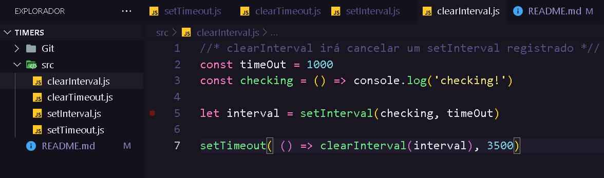

<h1 align="center">
  Estudando <b>NodeJS</b>
</h1>

  Esse é um projeto deito para meu aprendizado pessoal,o inicio dos meus estidos em NodeJs,
  com <b>Timers</b>, usando a plataforma de estudos Discover <b>Rocketseat</b>

 
